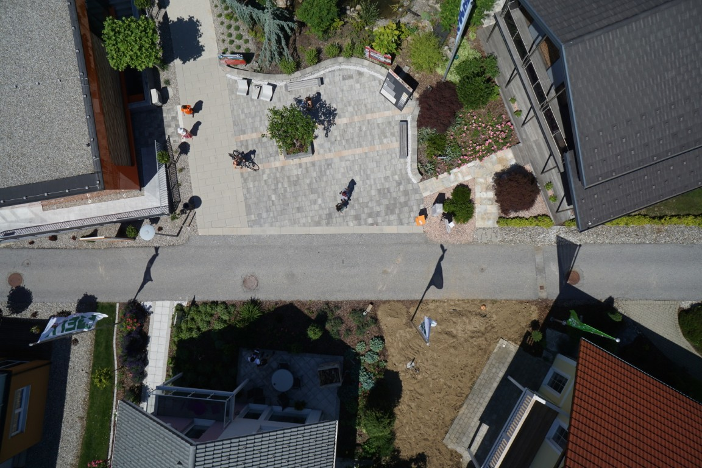
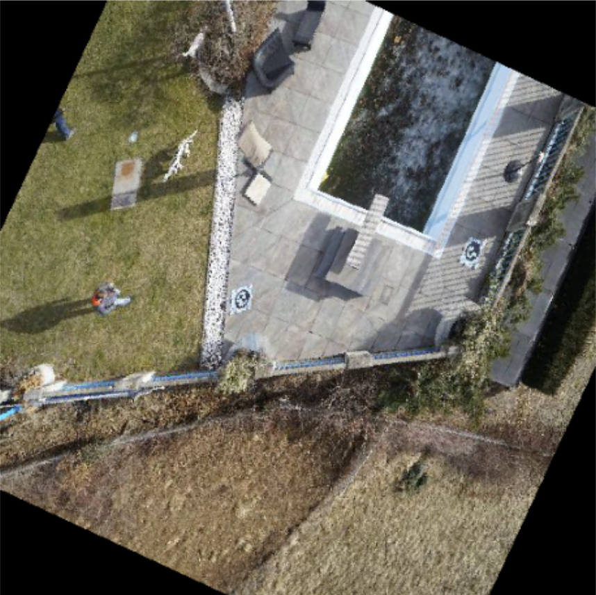
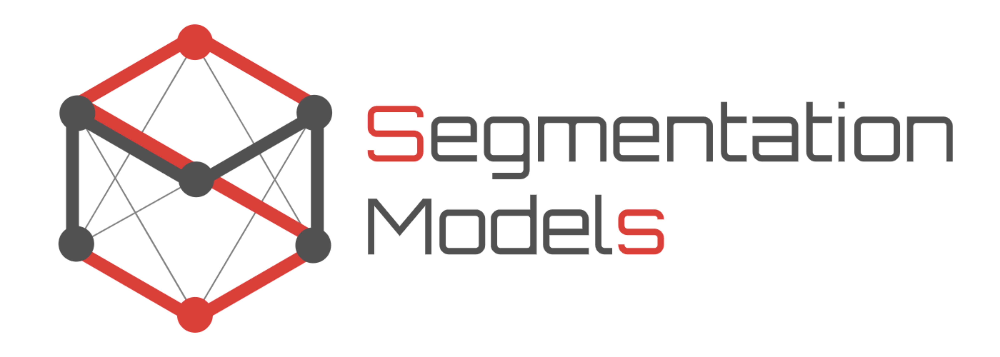
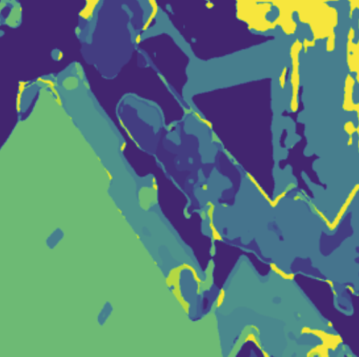
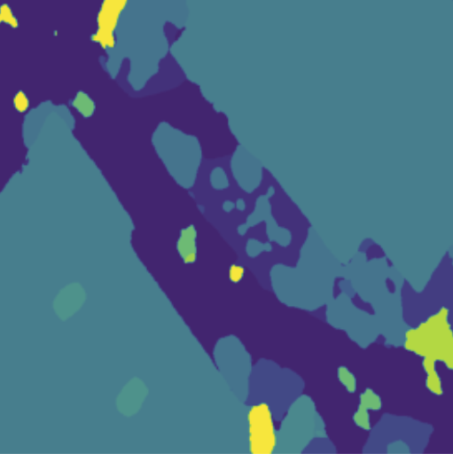

#  DroneSemSegNets - Semantic Segmentation of Drone Aerial Images

The following repository contains the code to perform semantic segmentation of drone aerial images using deep learning models. The code is implemented in Python using the Pytorch library and the Segmentation Models library. The code is available as a Jupyter Notebook file named `drone_sem_seg_nets.ipynb`.

The code is divided into the following sections:

- **Environment Setup:** sets up the Python environment and installs the required libraries.
- **Data Preprocessing:** loads the dataset, preprocesses the images, and splits the dataset into training, validation, and test subsets.
- **Data Augmentation:** augments the train-set using random rotation, random flip, random brightness, and random contrast.
- **Model Definition:** defines the models for semantic segmentation of drone aerial images.
- **Model Training:** trains the models on the train-set and evaluates them on the validation-set.
- **Model Evaluation:** evaluates the models on the test-set using the test loss, pixel-wise accuracy, and mean IoU.
- **Gradio UI:** creates a user interface to interact with the deep learning models and visualize the results.

## Introduction

The semantic segmentation is the process of classifying each pixel of an image into a specific class. This is a fundamental task in computer vision and it is used in several applications such as autonomous driving, medical imaging, and satellite image analysis. The semantic segmentation is a challenging task because it requires a deep understanding of the image content and it is computationally expensive. 

In this project, we focus on the semantic segmentation of drone aerial images. The images have been acquired from a high altitude and contain several objects such as buildings, roads, cars, trees and others. The goal of this project is to develop and compare deep learning models able to perform with a discrete accuracy the semantic segmentation of the given images.

The deep learning models are trained on a dataset of drone aerial images and their corresponding pixel-wise masks. The models are evaluated on a given test-set of images and their corresponding pixel-wise masks.

## Dataset

The choosen dataset is the [Semantic Drone Dataset](http://dronedataset.icg.tugraz.at/) built by the Austrian Institute of Computer Graphics and Vision (ICG) at Graz University of Technology. 
The dtaset focuses on semantic understanding of urban scenes for increasing the safety of autonomous drone flight and landing procedures. The imagery depicts  more than 20 houses from nadir (bird's eye) view acquired at an altitude of 5 to 30 meters above ground. A high resolution camera was used to acquire images at a size of 6000x4000px (24Mpx). The training set contains 400 publicly available images and the test set is made up of 200 private images. Each image is accompanied by a pixel-wise semantic segmentation mask with 24 classes annotated in both RGB and greyscale format.

##### Sample Images and Masks

| Image                     | RGB Mask                   | Greyscale Mask              |
| ------------------------- | -------------------------- | --------------------------- |
|  |  |  |
|  |  |  |

##### Classes Mapping

| Name          | R   | G   | B   | Mask Value  |
|---------------|-----|-----|-----|-------------|
| unlabeled     | 0   | 0   | 0   | 0           |
| paved-area    | 128 | 64  | 128 | 1           |
| dirt          | 130 | 76  | 0   | 2           |
| grass         | 0   | 102 | 0   | 3           |
| gravel        | 112 | 103 | 87  | 4           |
| water         | 28  | 42  | 168 | 5           |
| rocks         | 48  | 41  | 30  | 6           |
| pool          | 0   | 50  | 89  | 7           |
| vegetation    | 107 | 142 | 35  | 8           |
| roof          | 70  | 70  | 70  | 9           |
| wall          | 102 | 102 | 156 | 10          |
| window        | 254 | 228 | 12  | 11          |
| door          | 254 | 148 | 12  | 12          |
| fence         | 190 | 153 | 153 | 13          |
| fence-pole    | 153 | 153 | 153 | 14          |
| person        | 255 | 22  | 96  | 15          |
| dog           | 102 | 51  | 0   | 16          |
| car           | 9   | 143 | 150 | 17          |
| bicycle       | 119 | 11  | 32  | 18          |
| tree          | 51  | 51  | 0   | 19          |
| bald-tree     | 190 | 250 | 190 | 20          |
| ar-marker     | 112 | 150 | 146 | 21          |
| obstacle      | 2   | 135 | 115 | 22          |
| conflicting   | 255 | 0   | 0   | 23          |

## Data Preparation and Preprocessing

Data preparation and preprocessing are essential steps in deep learning projects to ensure that the data is in the right format and structure for training the models. The following data preparation and preprocessing steps are performed in this project:

- **Resizing:** the images dimension is scaled from 6000x4000 to 512x512 using nearest neighbor interpolation to avoid adding unwanted values to the segmentation masks.
- **Dataset paths table:** the dataset is loaded into a Pandas DataFrame to manage the images and masks efficiently.
- **Dataset class:** the dataset is converted into a Pytorch Dataset to be used in Pytorch models.
- **Normalization:** scales the image pixel values to a standard range, by subtracting the mean and dividing by the standard deviation to help the model converge faster.
- **Dataset split:** the dataset is split into training, validation, and test subsets using a 80-10-10 ratio.
- **DataLoader:** the dataset is converted into Pytorch DataLoader to load the images and masks in batches during training.

## Data Augmentation

Data augmentation is a technique used to artificially increase the size of the training dataset by applying random transformations to the images and masks. This helps the model generalize better and reduces overfitting. Data augmentation is applied during training without the need to save the augmented images to disk. The following data augmentation techniques are applied in this project:

- **Random Rotation:** Rotates the image by a random angle within a specified range.
- **Random Flip:** Flips the image horizontally or vertically with a specified probability.
- **Random Brightness:** Adjusts the brightness of the image by a random factor.
- **Random Contrast:** Alters the contrast of the image by a random factor.

| Augmented Image                 | Augmented Mask                  |
| ------------------------------- | ------------------------------- |
|  |  |

## Implemented Models

To implement the baseline model, pure Pytorch has been used. The more complex models are implemented using the [Segmentation Models](https://github.com/qubvel-org/segmentation_models.pytorch) library, which provides a collection of pre-trained deep learning models for semantic segmentation.

- **SimpleFCN** (*Simple Fully Convolutional Networks*) is a simple fully convolutional network that uses convolutional layers to learn the features of the input image and upsampling layers to generate the pixel-wise segmentation mask. In this project this is the baseline model, used as a reference for the other models to check how much they can improve the results.

- **FPN** (*Feature Pyramid Networks*) is a deep learning model that uses a top-down architecture with lateral connections to build high-level semantic feature maps at different scales. The model combines the features from different levels of the network to improve the segmentation performance.

- **DeepLabV3Plus** is a state-of-the-art deep learning model for semantic image segmentation that uses an encoder-decoder architecture with atrous separable convolution to capture multi-scale contextual information. The model also uses a feature pyramid network to combine features from different levels of the network.

The implemented baseline and models references can be found in the following table, with the corresponding name in code, paper title, authors, year, conference, and DOI:

| Model Name in Code | Paper Title                                                                       | Authors                                                                                     | Year | Conference                                                        | DOI                          |
| ------------------ | --------------------------------------------------------------------------------- | ------------------------------------------------------------------------------------------- | ---- | ----------------------------------------------------------------- | ---------------------------- |
| **SimpleFCN**      | Fully Convolutional Networks for Semantic Segmentation                            | Jonathan Long, Evan Shelhamer, Trevor Darrell                                               | 2015 | IEEE Conference on Computer Vision and Pattern Recognition (CVPR) | 10.1109/CVPR.2015.7298965    |
| **FPN**            | Feature Pyramid Networks for Object Detection                                     | Tsung-Yi Lin, Piotr Dollar, Ross Girshick, Kaiming He, Bharath Hariharan and Serge Belongie | 2017 | IEEE Conference on Computer Vision and Pattern Recognition (CVPR) | 10.1109/CVPR.2017.106        |
| **DeepLabV3Plus**  | Encoder-Decoder with Atrous Separable Convolution for Semantic Image Segmentation | Liang-Chieh Chen, Yukun Zhu, George Papandreou, Florian Schroff, Hartwig Adam               | 2018 | European Conference on Computer Vision (ECCV)                     | 10.1007/978-3-030-01234-2_23 |

## Models Training

Each model has been trained on a GPU, with the main traing elements defined below:

- **Optimizer:** the AdamW optimizer is used to optimize the model parameters during training. The AdamW optimizer is an extension of the Adam optimizer that uses weight decay (meaning that the bigger the weights, the more they are penalized) to prevent overfitting.

- **Loss Function:** the Jaccard Loss is used as the loss function for training the models since it is well-suited for semantic segmentation where the goal is to maximize the intersection over union (IoU) between the predicted mask and the ground truth mask.

- **Training Loop:** the models are trained using a batch size of 4-8, a learning rate of 0.0001, and a total of 50 epochs. A patience of 5 epochs is used for early stopping to prevent overfitting, using the validation loss as the monitoring metric. The models are trained on the training dataset and evaluated on the validation dataset after each epoch. The model with the best validation loss is saved and used for evaluation on the test-set.

- **Encoder Initialization:** the models are initialized with the weights of a pre-trained encoder (EfficientNet-B2) to speed up the training process and improve the generalization performance. The weights of the encoder are based on the ImageNet dataset, which contains a large number of diverse images. (Encoder used onlu for FPN and DeepLabV3Plus models).

## Models Evaluation Metrics

As metrics to evaluate the models, the following are used:

- **Test Loss:** the loss function value on the test-set, the lower the better.
- **Pixel-wise Accuracy:** the percentage of correctly classified pixels in the segmentation mask, the higher the better.
- **Mean IoU (Intersection over Union):** the ratio of the intersection area between the predicted mask and the ground truth mask to the union area of the two masks, the higher the better.

## Results

A set of images from the test-set have been used to evaluate the models and compare their performance. A sample from the input images, ground truth masks, and predicted masks are shown below for each model:

| Model | ■Input | ■Truth | Output |
| ----- | ------------- | -------------- | ----------------- |
| **SimpleFCN** |  |  |  |
| **FPN** |  |  |  |
| **DeepLabV3Plus** |  |  |  |

The metrics for the three models are shown in the following table:

| Model Name in Code | Test Loss           | Pixel-wise Accuracy | Mean IoU            |
| ------------------ | ------------------- | ------------------- | ------------------- |
| **SimpleFCN**      | 0.404585887119174   | 0.5130875587463379  | 0.11387407779693604 |
| **FPN**            | 0.25513803362846377 | 0.7556529998779297  | 0.4873158037662506  |
| **DeepLabV3Plus**  | 0.26401014514267446 | 0.750554370880127   | 0.4804820120334625  |

## Conclusions

In this project, we have developed and compared deep learning models for semantic segmentation of drone aerial images. The models have been trained and evaluated on a dataset of drone aerial images and their corresponding pixel-wise masks. The results show that the FPN and DeepLabV3Plus models outperform the SimpleFCN model in terms of pixel-wise accuracy and mean IoU. The FPN model achieves the highest pixel-wise accuracy and mean IoU among the three models. The results demonstrate the effectiveness of deep learning models for semantic segmentation of drone aerial images.

## Future Work

These days the challenges of the semantic segmentation are still open and there are many ways to improve the results. In this work, the computational resources were limited and the models were trained for a limited number of epochs. Using images of 512x512 pixels, the weights of the models can easly saturate the GPU memory, leading to a reduction of the batch size and the number of epochs. The models could be trained for more epochs with a larger batch size and a higher resolution of the images to improve the results. Moreover, the models could be fine-tuned on a larger dataset with more diverse images to improve their generalization performance. The models could also be optimized using a bigger encoder like EfficientNet-B7 to capture more complex features of the images, but this would require more computational resources, and to make a compromise between the images dimensions and the batch size.

## Gradio UI

To show results in a user-friendly way, has been implemented an user interface. This thanks to Gradio, an open-source Python package that allows to quickly create easy-to-use and customizable user interface components for using models.
Interface functions allow the upload of images from the dataset and the choice of a model from a drop-down menu with the list of implemented models. By clicking the submit button, it will be possible to obtain the grayscale mask image as a result of Semantic Segmentation.

## Authors

Enrico Maria Aldorasi, Emanuele Frasca
